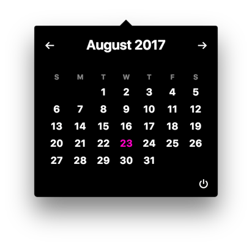

# Barnacal

> A simple menu bar app for viewing a calendar

<a href="screenshot.png" target="_blank" style="text-align:center;display:block;">
  
</a>

# Installation

To install Barnacal on your system, visit the [Releases](https://github.com/mike-engel/barnacal/releases) page. From there you can download the binary for your system. If your system isn't supported, consider opening an issue or pull request to add support for it.

# Developing

This a Node.js project at heart, so begin by installing the npm dependencies.

```sh
npm install
```

To start the front end compiler, run `npm run dev` in a terminal window. This will automatically watch and compile changes to your files.

```sh
npm run dev
```

Finally, open a new terminal window/tab and start the electron process. This will launch the app and you can begin using it.

```sh
npm run electron:start
```

If you want the electron app to be reloaded when you edit the html or JS files, then you'll want to install `watchexec` first, then run the watch command.

```sh
# install watchexec if you don't have it already
brew install watchexec

npm run watch:electron
```

# Debugging

You can open Chrome Dev Tools while developing
Put this in `index.js` inside `configureWindow` function. It will open Dev Tools in the calendar.

```javascript
window.webContents.openDevTools();
```

# Contributing

Issues and Pull requests are both welcomed! Prettier is enabled by default as a pre-commit hook, but feel free to add it to your editor.

# [Code of Conduct](CODE_OF_CONDUCT.md)

Please note that this project is released with a Contributor Code of Conduct. By participating in this project you agree to abide by its terms.

# [Changelog](https://github.com/mike-engel/barnacal/releases)

# [License](LICENSE.md)
